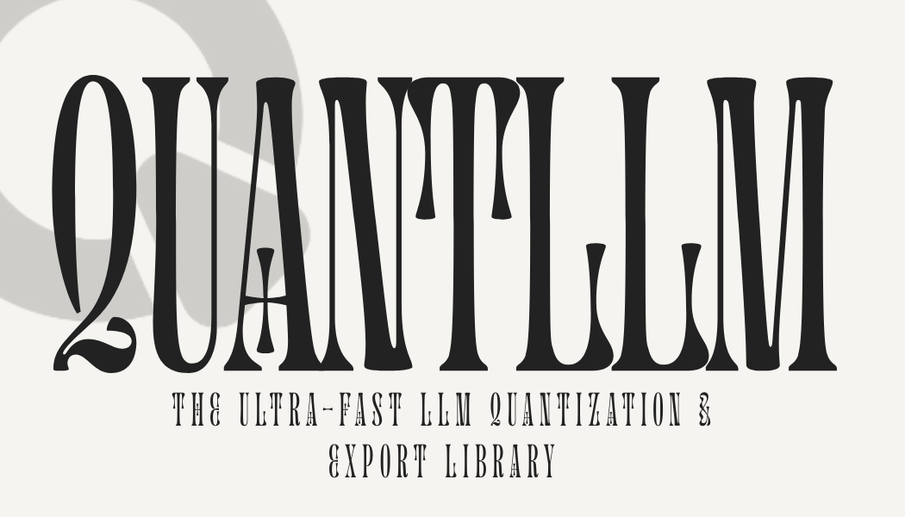

<div align="center">
  
  
  # 🚀 QuantLLM v2.1 (pre-release)
  
  **The Ultra-Fast LLM Quantization & Export Library**

  [](https://pepy.tech/projects/quantllm)
  [](https://pypi.org/project/quantllm/)
  [](https://www.python.org/)
  [](LICENSE)
  [](https://github.com/codewithdark-git/QuantLLM)

  **Load → Quantize → Fine-tune → Export** — All in One Line
  
  [Quick Start](#-quick-start) • 
  [Features](#-features) • 
  [Export Formats](#-export-formats) • 
  [Examples](#-examples) • 
  [Documentation](https://quantllm.readthedocs.io)

</div>

---

## 🎯 Why QuantLLM?

### ❌ Without QuantLLM (50+ lines of code)

```python
from transformers import AutoModelForCausalLM, BitsAndBytesConfig
from peft import LoraConfig, get_peft_model
import torch

bnb_config = BitsAndBytesConfig(
    load_in_4bit=True,
    bnb_4bit_use_double_quant=True,
    bnb_4bit_quant_type="nf4",
    bnb_4bit_compute_dtype=torch.bfloat16
)
model = AutoModelForCausalLM.from_pretrained(
    "meta-llama/Llama-3-8B",
    quantization_config=bnb_config,
    device_map="auto",
)
# Then llama.cpp compilation for GGUF...
# Then manual tensor conversion...
```

### ✅ With QuantLLM (4 lines of code)

```python
from quantllm import turbo

model = turbo(
    "meta-llama/Llama-3-8B",
    config={"format": "gguf", "quantization": "Q4_K_M", "push_format": "gguf"},
)  # Auto-quantizes
model.generate("Hello!")                    # Generate text
model.export()                              # Export to GGUF with shared config
```

---

## ⚡ Quick Start

### Installation

```bash
# Recommended
pip install git+https://github.com/codewithdark-git/QuantLLM.git

# With all export formats
pip install "quantllm[full] @ git+https://github.com/codewithdark-git/QuantLLM.git"
```

### Your First Model

```python
from quantllm import turbo

# Load with automatic optimization
model = turbo(
    "meta-llama/Llama-3.2-3B",
    config={"format": "gguf", "quantization": "Q4_K_M", "push_format": "gguf"},
)

# Generate text
response = model.generate("Explain quantum computing simply")
print(response)

# Export to GGUF
model.export("gguf", "model.Q4_K_M.gguf")
```

**QuantLLM automatically:**
- ✅ Detects your GPU and available memory
- ✅ Applies optimal 4-bit quantization
- ✅ Enables Flash Attention 2 when available
- ✅ Configures memory management

---

## ✨ Features

### 🔥 TurboModel API

One unified interface for everything:

```python
model = turbo(
    "mistralai/Mistral-7B",
    config={"format": "gguf", "quantization": "Q4_K_M", "push_format": "gguf"},
)
model.generate("Hello!")
model.finetune(data, epochs=3)
model.export()
model.push("user/repo")
```

### ⚡ Performance Optimizations

- **Flash Attention 2** — Auto-enabled for speed
- **torch.compile** — 2x faster training
- **Dynamic Padding** — 50% less VRAM
- **Triton Kernels** — Fused operations

### 🧠 45+ Model Architectures

Llama 2/3, Mistral, Mixtral, Qwen 1/2, Phi 1/2/3, Gemma, Falcon, DeepSeek, Yi, StarCoder, ChatGLM, InternLM, Baichuan, StableLM, BLOOM, OPT, MPT, GPT-NeoX...

### 📦 Multi-Format Export

| Format | Use Case | Command |
|--------|----------|---------|
| **GGUF** | llama.cpp, Ollama, LM Studio | `model.export("gguf")` |
| **ONNX** | ONNX Runtime, TensorRT | `model.export("onnx")` |
| **MLX** | Apple Silicon (M1/M2/M3/M4) | `model.export("mlx")` |
| **SafeTensors** | HuggingFace | `model.export("safetensors")` |

### 🎨 Beautiful Console UI

```
╔════════════════════════════════════════════════════════════╗
║   🚀 QuantLLM v2.1.0rc1                                    ║
║   Ultra-fast LLM Quantization & Export                     ║
║   ✓ GGUF  ✓ ONNX  ✓ MLX  ✓ SafeTensors                     ║
╚════════════════════════════════════════════════════════════╝

📊 Model: meta-llama/Llama-3.2-3B
   Parameters: 3.21B
   Memory: 6.4 GB → 1.9 GB (70% saved)
```

### 🤗 One-Click Hub Publishing

Auto-generates model cards with YAML frontmatter, usage examples, and "Use this model" button:

```python
model.push("user/my-model")
```

---

## 📦 Export Formats

Export to any deployment target with a single line:

```python
from quantllm import turbo

model = turbo("microsoft/phi-3-mini")

# GGUF — For llama.cpp, Ollama, LM Studio
model.export("gguf", "model.Q4_K_M.gguf", quantization="Q4_K_M")

# ONNX — For ONNX Runtime, TensorRT  
model.export("onnx", "./model-onnx/")

# MLX — For Apple Silicon Macs
model.export("mlx", "./model-mlx/", quantization="4bit")

# SafeTensors — For HuggingFace
model.export("safetensors", "./model-hf/")
```

### GGUF Quantization Types

| Type | Bits | Quality | Use Case |
|------|------|---------|----------|
| `Q2_K` | 2-bit | 🔴 Low | Minimum size |
| `Q3_K_M` | 3-bit | 🟠 Fair | Very constrained |
| `Q4_K_M` | 4-bit | 🟢 Good | **Recommended** ⭐ |
| `Q5_K_M` | 5-bit | 🟢 High | Quality-focused |
| `Q6_K` | 6-bit | 🔵 Very High | Near-original |
| `Q8_0` | 8-bit | 🔵 Excellent | Best quality |

---

## 🎮 Examples

### Chat with Any Model

```python
from quantllm import turbo

model = turbo(
    "meta-llama/Llama-3.2-3B",
    config={"format": "gguf", "quantization": "Q4_K_M", "push_format": "gguf"},
)

# Simple generation
response = model.generate(
    "Write a Python function for fibonacci",
    max_new_tokens=200,
    temperature=0.7,
)
print(response)

# Chat format
messages = [
    {"role": "system", "content": "You are a helpful coding assistant."},
    {"role": "user", "content": "How do I read a file in Python?"},
]
response = model.chat(messages)
print(response)
```

### Load GGUF Models

```python
from quantllm import TurboModel

model = TurboModel.from_gguf(
    "TheBloke/Llama-2-7B-Chat-GGUF", 
    filename="llama-2-7b-chat.Q4_K_M.gguf"
)
print(model.generate("Hello!"))
```

### Fine-Tune with Your Data

```python
from quantllm import turbo

model = turbo("mistralai/Mistral-7B")

# Simple training
model.finetune("training_data.json", epochs=3)

# Advanced configuration
model.finetune(
    "training_data.json",
    epochs=5,
    learning_rate=2e-4,
    lora_r=32,
    lora_alpha=64,
    batch_size=4,
)
```

**Supported data formats:**

```json
[
  {"instruction": "What is Python?", "output": "Python is..."},
  {"text": "Full text for language modeling"},
  {"prompt": "Question", "completion": "Answer"}
]
```

### Push to HuggingFace Hub

```python
from quantllm import turbo

model = turbo("meta-llama/Llama-3.2-3B")

# Push with auto-generated model card
model.push(
    "your-username/my-model",
    license="apache-2.0"
)
```

---

## 💻 Hardware Requirements

| Configuration | GPU VRAM | Recommended Models |
|---------------|----------|-------------------|
| 🟢 **Entry** | 6-8 GB | 1-7B (4-bit) |
| 🟡 **Mid-Range** | 12-24 GB | 7-30B (4-bit) |
| 🔴 **High-End** | 24-80 GB | 70B+ |

**Tested GPUs:** RTX 3060/3070/3080/3090/4070/4080/4090, A100, H100, Apple M1/M2/M3/M4

---

## 📦 Installation Options

```bash
# Basic
pip install git+https://github.com/codewithdark-git/QuantLLM.git

# With specific features
pip install "quantllm[gguf]"     # GGUF export
pip install "quantllm[onnx]"     # ONNX export  
pip install "quantllm[mlx]"      # MLX export (Apple Silicon)
pip install "quantllm[triton]"   # Triton kernels
pip install "quantllm[full]"     # Everything
```

---

## 🏗️ Project Structure

```
quantllm/
├── core/                    # Core API
│   ├── turbo_model.py      # TurboModel unified API
│   └── smart_config.py     # Auto-configuration
├── quant/                   # Quantization
│   └── llama_cpp.py        # GGUF conversion
├── hub/                     # HuggingFace
│   ├── hub_manager.py      # Push/pull models
│   └── model_card.py       # Auto model cards
├── kernels/                 # Custom kernels
│   └── triton/             # Fused operations
└── utils/                   # Utilities
    └── progress.py         # Beautiful UI
```

---

## 🤝 Contributing

```bash
git clone https://github.com/codewithdark-git/QuantLLM.git
cd QuantLLM
pip install -e ".[dev]"
pytest
```

**Areas for contribution:**
- 🆕 New model architectures
- 🔧 Performance optimizations
- 📚 Documentation
- 🐛 Bug fixes

**Quick template for new architecture support:**
```python
from quantllm import register_architecture, turbo

register_architecture("new-arch", base_model_type="llama")
model = turbo("org/new-arch-7b", base_model_fallback=True, trust_remote_code=True)
```

---

## 📜 License

MIT License — see [LICENSE](LICENSE) for details.

---

<div align="center">
  
### Made with 🧡 by [Dark Coder](https://github.com/codewithdark-git)

[⭐ Star on GitHub](https://github.com/codewithdark-git/QuantLLM) •
[🐛 Report Bug](https://github.com/codewithdark-git/QuantLLM/issues) •
[💖 Sponsor](https://github.com/sponsors/codewithdark-git)

**Happy Quantizing! 🚀**

</div>
